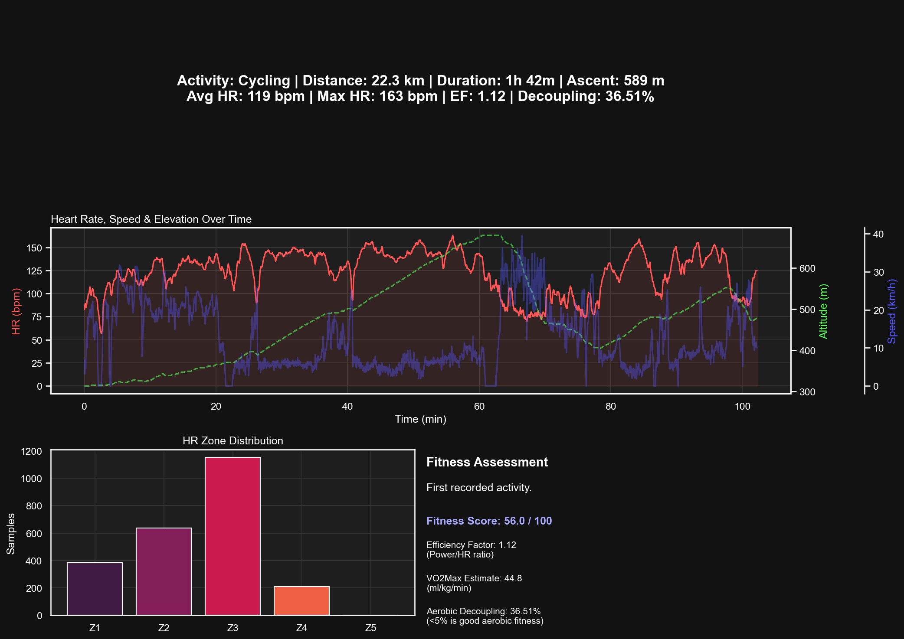

# Fit File Analyzer

A powerful, high-performance Python application designed to analyze and visualize Garmin FIT files. Whether you're a cyclist or a runner, this tool provides deep insights into your activities with a focus on data integrity and visual clarity.



## 🚀 Key Features

-   **Interactive Visualization**: View your GPS tracks on an interactive map and explore performance metrics (Speed, Power, Heart Rate, Altitude, Temperature) in a synchronized, selectable plot.
-   **Synthetic Loop Closer**: Unique logic that detects dropped GPS signals. If your recording stops early but you finished at the start, the analyzer automatically interpolates the missing data to "close the loop" and restore your full distance.
-   **Offline Reverse Geocoding**: Instantly see where your rides took place (e.g., "Graz, Styria") using an offline database—no internet connection required for location lookups.
-   **Smart Metrics Engine**:
    *   **Normalized Power (NP)**: Calculated using industry-standard 30-second rolling averages.
    *   **Calorie Estimation**: Scientifically derived formulas for both cycling and running.
    *   **Elevation Analysis**: Smoothed altitude data with accurate gain calculation.
-   **Sortable Activity Browser**: A feature-rich table to organize your FIT files by date, distance, duration, or geographic location.
-   **Privacy Focused**: All processing is done locally on your machine.

## 🛠️ Technology Stack

-   **Language**: Python 3
-   **GUI Framework**: PySide6 (Qt for Python)
-   **Data Processing**: Pandas, NumPy
-   **Mapping**: Folium, QWebEngine
-   **Plotting**: PyQtGraph
-   **Geocoding**: Reverse Geocoder (Offline)

## 📦 Installation

1.  **Clone the repository**:
    ```bash
    git clone https://github.com/yourusername/fit_analyser.git
    cd fit_analyser
    ```

2.  **Set up a virtual environment**:
    ```bash
    python3 -m venv venv
    source venv/bin/activate
    ```

3.  **Install dependencies**:
    ```bash
    pip install -r requirements.txt
    ```

## 🖥️ Usage

Simply run the main script to start the application:

```bash
python main.py
```

Upon startup, the application automatically scans the current working directory for `.fit` files. You can select a different folder using the "Select Folder" button.

## ⚙️ Configuration

You can customize user weight and equipment settings in the **Settings** tab to improve the accuracy of power and calorie estimations.

## 🤝 Contributing

Contributions are welcome! Feel free to open issues or submit pull requests to improve the parser, add new metrics, or enhance the UI.

## 📜 License

This project is licensed under the MIT License - see the LICENSE file for details.
